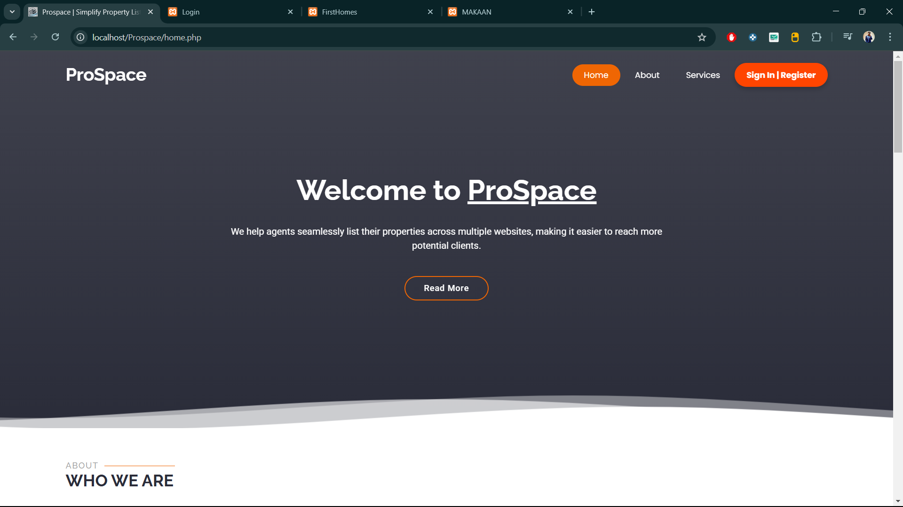
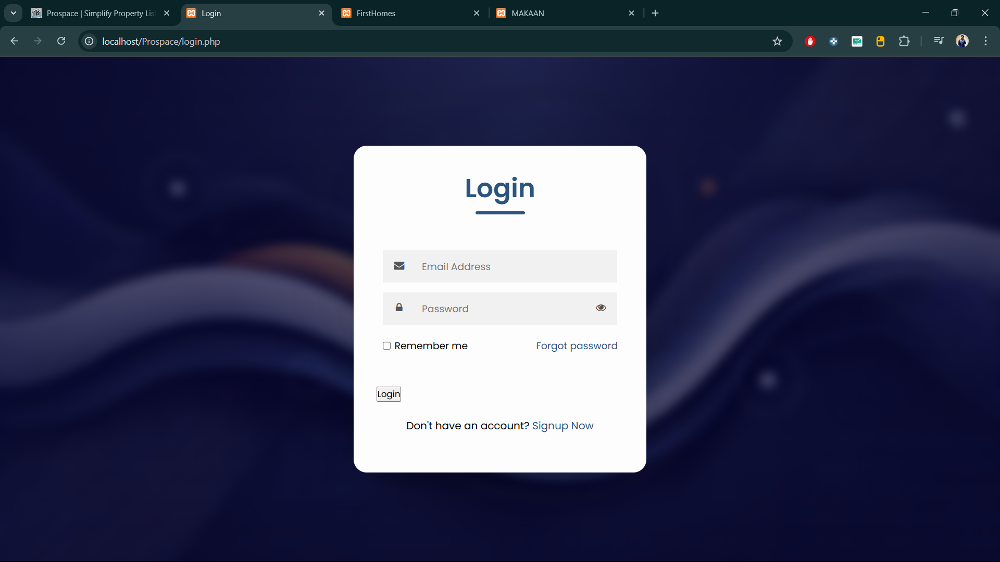
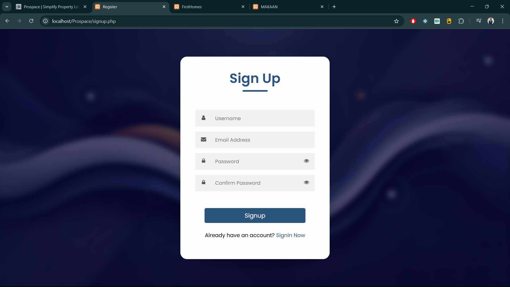
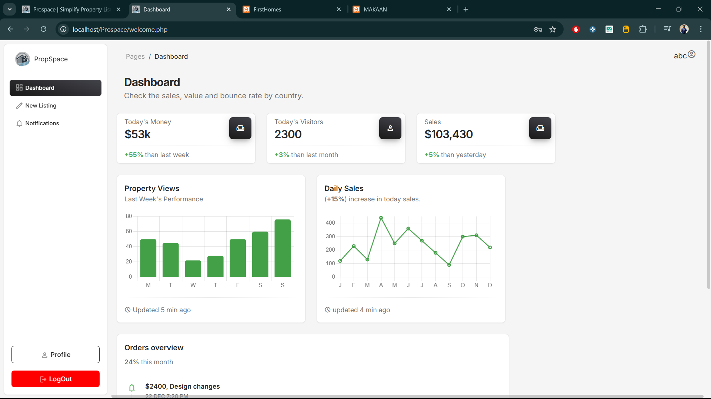
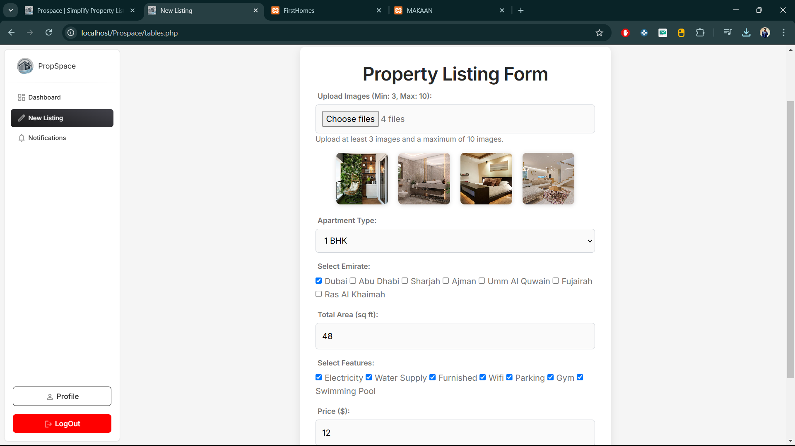
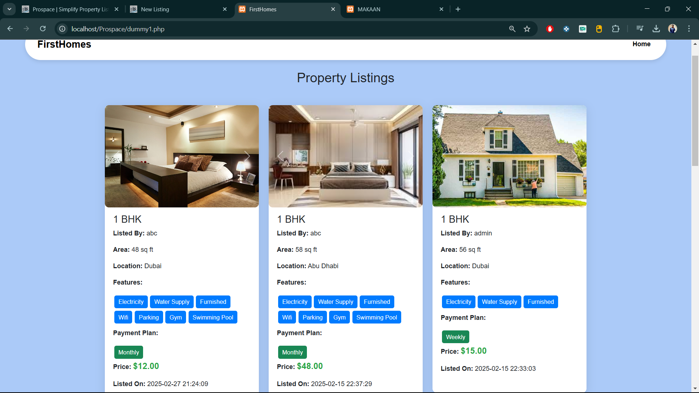
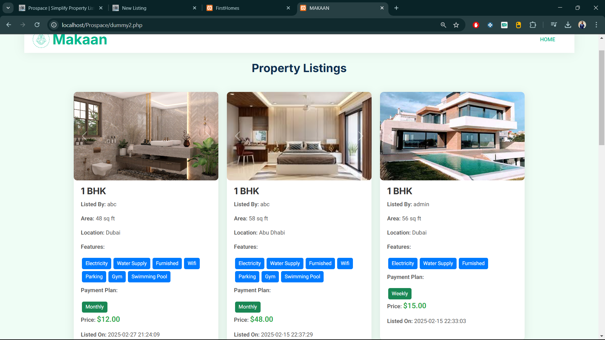
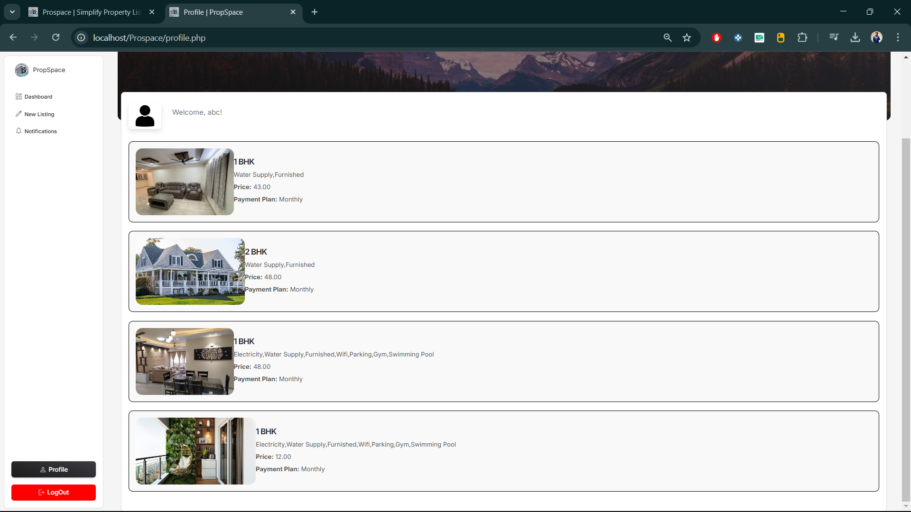

# CRM based Property Listing Website
A dynamic property listing platform built with HTML, PHP, and MySQL, allowing users to upload property listings, which are then displayed on two dummy websites.

# 🌟 Features
✅ Users can upload property listings with images, price, and details  
✅ Listings automatically appear on two dummy websites  
✅ Search and filter functionality for easy browsing  
✅ Admin panel for managing listings  
✅ Secure user authentication (if implemented)  
✅ Responsive design for mobile and desktop users  

# 🛠️ Technologies Used
Frontend: HTML, CSS, JavaScript  
Backend: PHP  
Database: MySQL  
Server: XAMPP / Apache  

# 🚀 Installation Guide
1. Clone the Repository:  
git clone https://github.com/imreet/property-listing.git  
cd property-listing  

2. Setup Database:  
Import login_system.sql into MySQL using phpMyAdmin.  

3. Set Up Dummy Websites:  
Place the dummy website folders in htdocs/ (C:/xampp/htdocs/Property-listing/dummy1.php and C:/xampp/htdocs/Property-listing/dummy2.php).  
Ensure they correctly fetch listings from the main database.  

4. Run the Project:  
Start XAMPP (Apache & MySQL).  
Open your browser and go to:  
http://localhost/property-listing/home.php  
http://localhost/dummy1.php  
http://localhost/dummy2.php  

# 📸 Screenshots
Home:
  

Login:
  

SignUp:
  

Welcome/ Dashboard:
  

Listings:
  

Dummy1 - FirstHomes:
  
Link: http://localhost/Property-Listing/dummy1.php  

Dummy2 - MAKAAN:
  
Link: http://localhost/Property-Listing/dummy2.php

Once clicekd on submit, all the listings are listed onto these two dummy websites simultaneously.  

Profile:

The listings posted by the users are diplayed onto their profile  

# Login Details
Username:abc | Password: abc123
You can also create your own username 

# 📜 License
This project is open-source. Feel free to modify and use it.
